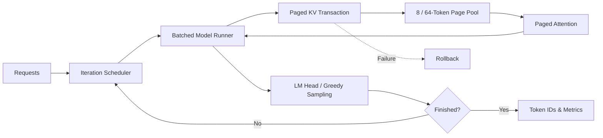

# Kim-LLM-Runtime

基于 C++/CUDA 实现的单 GPU LLM 推理运行时。项目以异构 Paged KV Cache 为核心，
打通 TinyLlama 1.1B FP16 从动态组批、模型执行到 Greedy Generation 的完整链路。



## 特性

### 1. 异构 Paged KV Cache

- 8-Token Micro Page 与 64-Token Extent Page 协同管理短、长序列
- 支持 Prefix Fork、Partial-Tail COW、Page Lease，以及 Generation 路径自动 Promotion
- 每个新完成的 64-Token 对齐区间自动将 8 个 Micro Page 合并为 1 个 Extent Page；失败保留原布局
- Token 级事务保证全部 Decoder Layer 成功后提交，失败自动回滚
- 提供 Fixed-8/16/32/64 基线，用于公平比较碎片率和数据路径开销

### 2. CUDA Model Runner

- 完整 TinyLlama FP16 Decoder、LM Head 和 Greedy Argmax
- 基于 cuBLAS 的动态 Batched GEMM，支持 GQA Paged Decode Attention
- 预分配执行 Workspace，权重 Manifest 校验 Shape、Offset 与 SHA-256

### 3. Iteration Scheduler

- FIFO 动态组批，支持 c1/c2/c4 并发请求的加入、退出和取消
- 支持 Chunked Prefill 与 Decode 混合调度
- 提供请求级失败隔离及 TTFT、TPOT、E2E、Batch 利用率统计

## 验证结果

测试环境：RTX 3060 12 GiB、CUDA 12.6.85、TinyLlama 1.1B Chat FP16。

| 项目 | 结果 |
|---|---:|
| CPU / CUDA Release | `13/13 PASS` / `20/20 PASS` |
| CPU ASan/UBSan | `13/13 PASS` |
| CUDA Sanitizer | memcheck、racecheck、initcheck 均为 `0 errors` |
| 模型正确性 | Hidden、Logits、Top-10 通过数值门禁 |
| 端到端生成 | 8 个 Prompt 的完整 Token 与 Transformers FP16 一致 |
| KV 收益 | Long Gather `-65.03%`；相对 Fixed-64 碎片减少 `88.69%～91.63%` |

完整结果位于 `tests/reference` 和 `benchmarks/results`。

## 构建与测试

```bash
# CPU
cmake --preset cpu-release
cmake --build --preset cpu-release --parallel
ctest --preset cpu-release

# CUDA（默认目标架构 SM 86）
CUDACXX=/path/to/nvcc cmake --preset cuda-release
cmake --build --preset cuda-release --parallel
ctest --preset cuda-release
```

## 运行

使用 `scripts/convert_tinyllama_weights.py` 转换 Hugging Face 权重后运行：

```bash
build-k5-cuda-release/tools/kim_kv_tinyllama_generate \
  --manifest /path/to/model.manifest \
  --weights /path/to/model.weights \
  --tokens 1,450,7483,310,3444,338 \
  --max-new-tokens 32 \
  --output /tmp/generation.json
```

完整 KV 与端到端测试矩阵：

```bash
scripts/run_k6_release_matrix.sh
scripts/run_e5_end_to_end.sh
```

## 当前边界

- 单 GPU、单模型、同步 Scheduler
- Ragged Batched Paged Attention 已实现
- KV Write 与事务提交仍按 Batch Lane 处理，Attention Scores 与 Output 仍为两个 Kernel
- Chunk 内按因果 Wave 逐 Token 推进，尚未实现融合的多 Token Prefill Attention
- 自动 Promotion 当前在 Token Commit 边界同步执行；失败后不做后台重试
