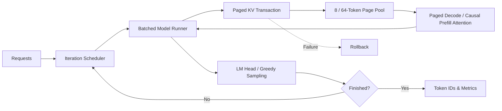

# Kim-LLM-Runtime

基于 C++/CUDA 实现的单 GPU LLM 推理运行时。项目以异构 Paged KV Cache 为核心，
打通 TinyLlama 1.1B FP16 从动态组批、模型执行到 Greedy Generation 的完整链路。


```mermaid
flowchart LR
    A[Requests] --> B[Iteration Scheduler]
    B --> C[Batched Model Runner]
    C --> D[Paged KV Transaction]
    D --> E[8 / 64-Token Page Pool]
    E --> F[Paged Decode / Causal Prefill Attention]
    F --> C
    C --> G[LM Head / Greedy Sampling]
    G --> H{Finished?}
    H -->|No| B
    H -->|Yes| I[Token IDs & Metrics]
    D -. Failure .-> J[Rollback]
```

## 特性

### 1. 异构 Paged KV Cache

- 8-Token Micro Page 与 64-Token Extent Page 协同管理短、长序列
- 支持 Prefix Fork、Partial-Tail COW、Page Lease，以及 Generation 路径自动 Promotion
- 每个新完成的 64-Token 对齐区间自动将 8 个 Micro Page 合并为 1 个 Extent Page；失败保留原布局
- 连续 Token 段事务保证全部 Decoder Layer 成功后原子提交，失败整体回滚
- 提供 Fixed-8/16/32/64 基线，用于公平比较碎片率和数据路径开销

### 2. CUDA Model Runner

- 完整 TinyLlama FP16 Decoder、LM Head 和 Greedy Argmax
- 基于 cuBLAS 的动态 Token-Batched GEMM，支持 Batched Decode 与 Multi-token Prefill
- 多 Token KV Write 可跨 Page/COW Tail，Paged Prefill Attention 对 Chunk 内 Query 应用因果 Mask
- Fused Paged Attention 默认启用 Descriptor Cursor：每个 Warp 只定位一次起始页，页内复用 Descriptor 与 Page 指针，跨页时顺序推进
- 预分配执行 Workspace，权重 Manifest 校验 Shape、Offset 与 SHA-256

### 3. Iteration Scheduler

- FIFO 动态组批，支持 c1/c2/c4 并发请求的加入、退出和取消
- 支持真正的 Multi-token Chunked Prefill 与 Decode 混合调度
- 提供请求级失败隔离及 TTFT、TPOT、E2E、Batch 利用率统计

## 验证结果

测试环境：RTX 3060 12 GiB、CUDA 12.6.85、TinyLlama 1.1B Chat FP16。

| 项目 | 结果 |
|---|---:|
| CPU / CUDA Release | `13/13 PASS` / Reference、Fused（默认含 Cursor）、Fused (No Cursor) 各 `21/21 PASS` |
| CPU ASan/UBSan | `13/13 PASS` |
| CUDA Sanitizer | Reference/Fused（无 Cursor）× 4 个 CUDA 合同 × 3 个工具，`24/24 PASS`；含 Cursor 的 Fused 在 `bfc1cc0` 与默认开启后的 `9030214` 各 `12/12 PASS`；memcheck/initcheck `0 errors`，racecheck `0 errors/0 warnings` |
| 模型正确性 | Hidden、Logits、Top-10 通过数值门禁 |
| 端到端生成 | 8 个 Prompt 的完整 Token 与 Transformers FP16 一致；long 套件 10 个唯一 Prompt（32/512/1024-Token）同样完全一致 |
| 正式性能矩阵 | 五策略 × 9 Case × 3 轮，`135/135` 个 Run 的预期结果与资源回收全部通过 |
| Fusion 正式 A/B | Reference/Fused × 五策略 × 9 Case × 3 轮，共 `270/270` 个 Run；配置、Token、故障/容量结果一致 |
| KV 收益（`66067cf`，Reference Attention） | Hetero 相对 Fixed-8 的 Long c1/c2/c4 E2E p50 降低 `17.13%/14.56%/11.85%`，Output tokens/s 提高 `20.73%/15.89%/13.42%` |
| Fusion 收益 | Hetero 的 Short c1/c2/c4 E2E p50 降低 `12.54%/13.86%/18.96%`，Long c1/c2/c4 降低 `34.34%/41.21%/53.13%`，Mixed c4 降低 `44.68%` |
| 容量边界 | Hetero 峰值碎片为 `0`，Capacity 完成数 `30`，高于 Fixed-64 的 `24`、低于 Fixed-8/16/32 的 `48` |
| Descriptor Cursor 正式 A/B | standard 套件：无/有 Cursor × 五策略 × 9 Case × 3 轮，`270/270` 个 Run；long 套件：无/有 Cursor × 五策略 × 4 Case × 3 轮，`120/120` 个 Run；配置、Token、故障/容量结果一致 |
| Descriptor Cursor 收益 | long 套件 `20/20` 个策略/Case 的 E2E p50 降低，中位 `29.87%`（`6.20%～72.03%`）；1024-Token c1/c4 在 Hetero 降低 `23.39%/30.13%`、Fixed-8 降低 `67.30%/72.03%`；standard 套件（上下文 ≤160 Token）E2E 无可分辨变化；Kernel 层（开发期 NCU）1024-Token 8 请求 Batch `705.38 → 251.30 us` |
| 分页策略与 Cursor | long 套件关闭 Cursor 时五策略 E2E p50 最大差距达 `163%`，开启后 ≤`6.49%`，Hetero 相对 Fixed-8 仅 `-0.97%～-3.15%`：长上下文下页粒度带来的 E2E 差异主要来自逐 Token Descriptor 查找，Cursor 默认开启后异构分页的收益主要体现在碎片与容量 |

完整结果位于 `tests/reference` 和 `benchmarks/results`；分页策略正式 E5 证据为
`benchmarks/results/66067cf69125_20260910T104436Z_e5`，Reference/Fused 正式 A/B 证据为
`benchmarks/results/0dc98d1149b1_20260917T075135Z_fusion_e5`；Descriptor Cursor standard 套件 A/B 与
Sanitizer 证据为 `benchmarks/results/bfc1cc063147_20260930T031045Z_fused_fused_cursor_e5` 与
`benchmarks/results/bfc1cc063147_20260930T030301Z_compute_sanitizer`；Cursor 默认开启后的 long 套件 A/B 与
Sanitizer 证据为 `benchmarks/results/90302140b4a4_20260930T120931Z_fused_no_cursor_fused_long_e5` 与
`benchmarks/results/90302140b4a4_20260930T120801Z_compute_sanitizer`。

## 构建与测试

```bash
# CPU
cmake --preset cpu-release
cmake --build --preset cpu-release --parallel
ctest --preset cpu-release

# CUDA（默认目标架构 SM 86）
CUDACXX=/path/to/nvcc cmake --preset cuda-release
cmake --build --preset cuda-release --parallel
ctest --preset cuda-release

# Reference/Fused Compute Sanitizer 矩阵
scripts/run_compute_sanitizer_matrix.sh

# Fused（默认含 Descriptor Cursor）；关闭 Cursor 的 A/B 基线预设为 cuda-release-fused-no-cursor
CUDACXX=/path/to/nvcc cmake --preset cuda-release-fused
cmake --build --preset cuda-release-fused --parallel
ctest --preset cuda-release-fused

# 指定变体的 Sanitizer（reference / fused / fused-no-cursor；结果目录置于仓库外以保持工作区干净）
KIM_KV_SANITIZER_VARIANTS=fused KIM_KV_RESULTS_ROOT=/path/outside/repo \
  scripts/run_compute_sanitizer_matrix.sh
```

## 运行

使用 `scripts/convert_tinyllama_weights.py` 转换 Hugging Face 权重后运行：

```bash
build-k5-cuda-release/tools/kim_kv_tinyllama_generate \
  --manifest /path/to/model.manifest \
  --weights /path/to/model.weights \
  --tokens 1,450,7483,310,3444,338 \
  --max-new-tokens 32 \
  --output /tmp/generation.json
```

完整 KV 与端到端测试矩阵：

```bash
scripts/run_k6_release_matrix.sh
scripts/run_e5_end_to_end.sh

# Reference/Fused × 五种分页策略的正式 E2E A/B 矩阵
scripts/run_fusion_e5_matrix.sh

# 关闭/开启 Descriptor Cursor × 五种分页策略的正式 E2E A/B 矩阵
KIM_KV_FUSION_E5_IMPLEMENTATIONS="fused-no-cursor fused" scripts/run_fusion_e5_matrix.sh

# 同上，改用 512/1024-token 长上下文套件（不含故障/容量 Case）
KIM_KV_E5_SUITE=long KIM_KV_FUSION_E5_IMPLEMENTATIONS="fused-no-cursor fused" \
  scripts/run_fusion_e5_matrix.sh
```

## 当前边界

- 单 GPU、单模型、同步 Scheduler
- Ragged Batched Decode Attention 与 Multi-token Causal Prefill Attention 已实现
- 单 Token 多请求继续使用 Batch KV/Attention Kernel；包含多 Token Chunk 的混合 Batch 当前按请求提交 KV/Attention Kernel
- Reference 路径的 Prefill Attention Scores 与 Softmax/Value Output 仍为两个 Kernel；Fused 路径在 head dimension ≤128 时使用在线 Softmax 单 Kernel，>128 回退 Reference；两条路径仍保留 Score Workspace 接口
- Descriptor Cursor 由 `KIM_KV_ENABLE_DESCRIPTOR_CURSOR` 控制：首次配置时跟随 Fusion 默认开启，要求 Fusion ON；`cuda-release-fused` 开启，`cuda-release-fused-no-cursor` 关闭作为 A/B 基线
- 自动 Promotion 当前在 Token Commit 边界同步执行；失败后不做后台重试
